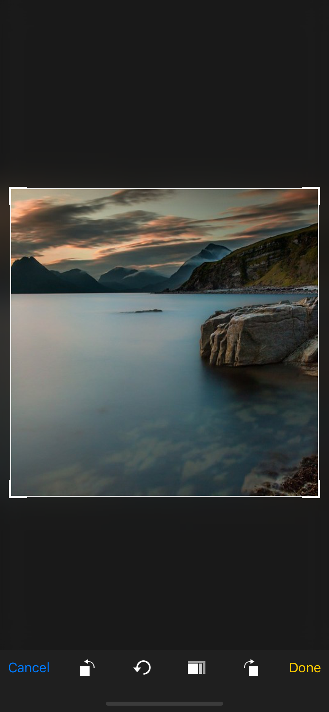
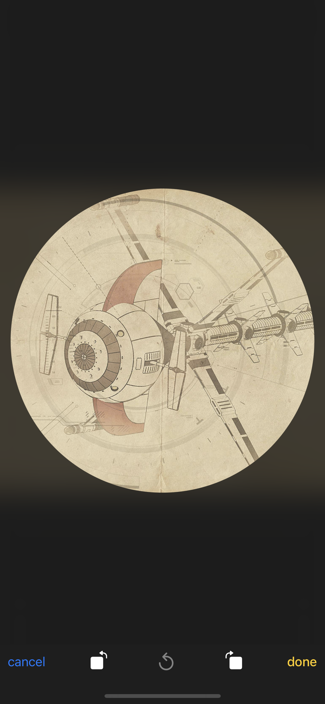

# Titanium Image Cropping Tool

An easy to crop images to different scales. Based on the awesome [TOCropViewController](https://github.com/TimOliver/TOCropViewController) library. Currently iOS only (!)




## Requirements

- [x] Titanium SDK 9.2.0+ (this module  is 100 % Swift based)

## Methods

### `showCropDialog`

#### Parameters

- `image` (String, Ti.Blob, Ti.File)
- `croppingStyle` 'circular' or 'default' (String) in not set 'default' is selected

- `aspectRatio` (either a dictionary {x, y}  of the ratio or one of the constants * below)

## Constants

- `ASPECT_RATIO_SQUARE`
- `ASPECT_RATIO_3x2`
- `ASPECT_RATIO_5x3`
- `ASPECT_RATIO_4x3`
- `ASPECT_RATIO_5x4`
- `ASPECT_RATIO_7x5`
- `ASPECT_RATIO_16x9`

## Events

- `done`
  - Attributes: `image` (Ti.Blob, if finished cropping), `cancel` (`true` if cancelled, `false` if completetd)
- `close`

## Example

```js
import ImageCrop from 'ti.imagecrop';

ImageCrop.addEventListener('done', event => {
  if (event.cancel) {
    return;
  }

  win.add(Ti.UI.createImageView({ height: 400, image: event.image }));
});

ImageCrop.addEventListener('close', event => {
  // Open other windows after the close has been triggered
  // to prevent transition glitches
});

const win = Ti.UI.createWindow({
  backgroundColor: '#fff'
});

const btn = Ti.UI.createButton({
  title: 'Show crop dialog'
});

btn.addEventListener('click', () => {
  ImageCrop.showCropDialog({
    image: 'test.jpg'
  });
});

win.add(btn);
win.open();
```

## License

MIT

## Author

Hans Knöchel
